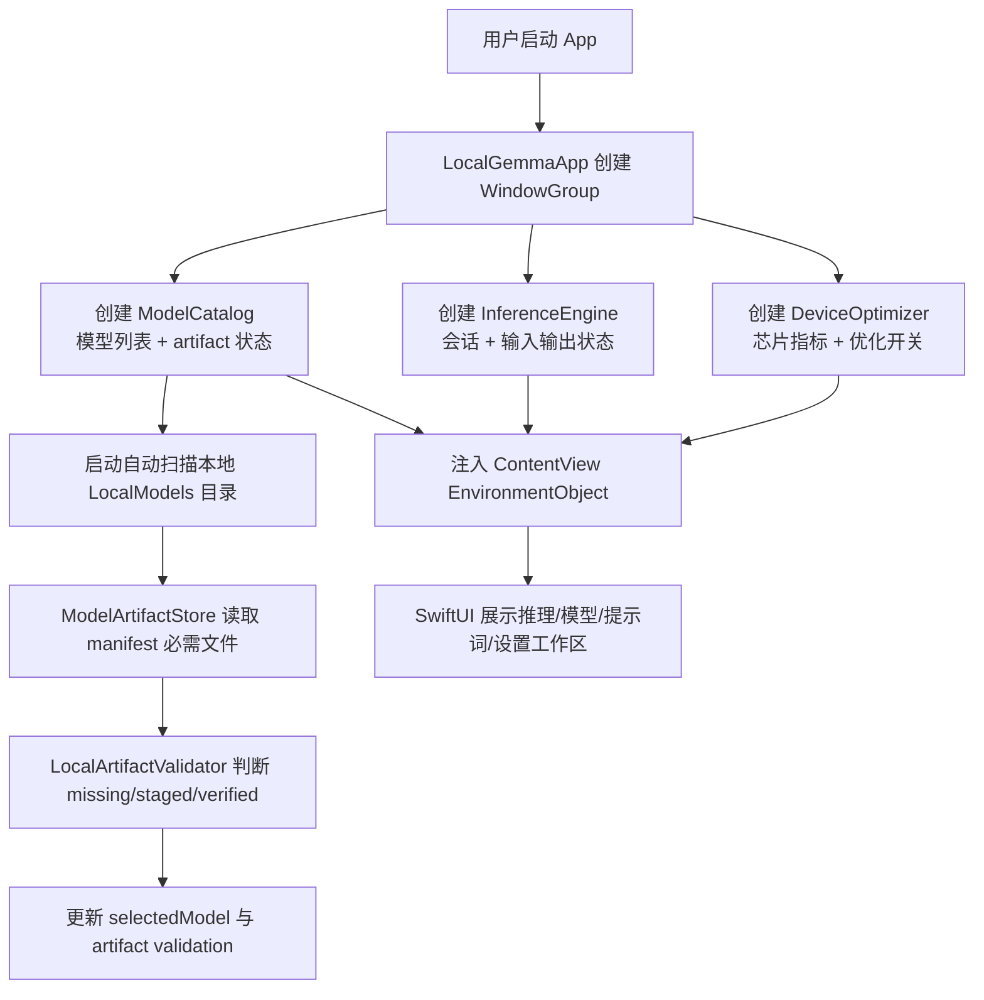
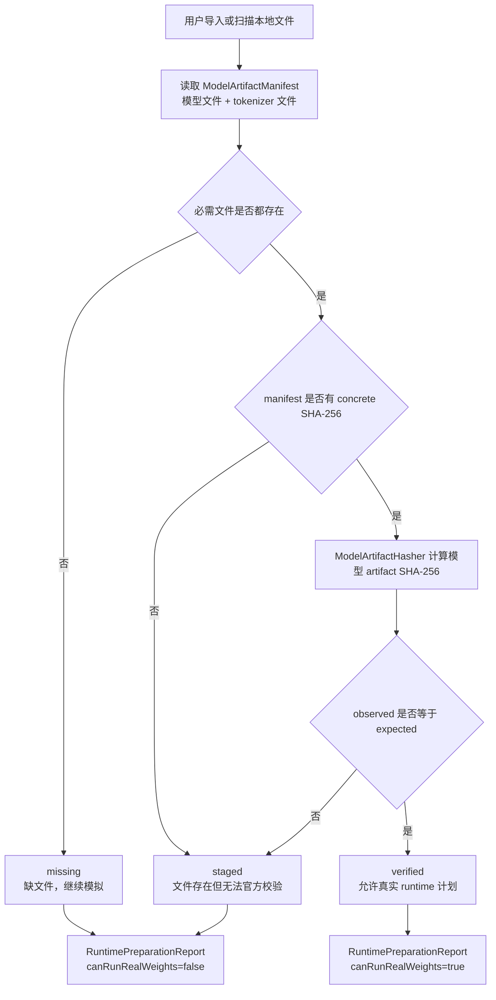
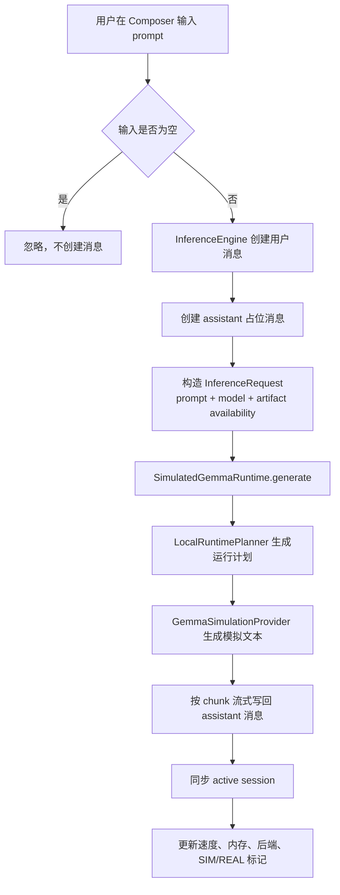
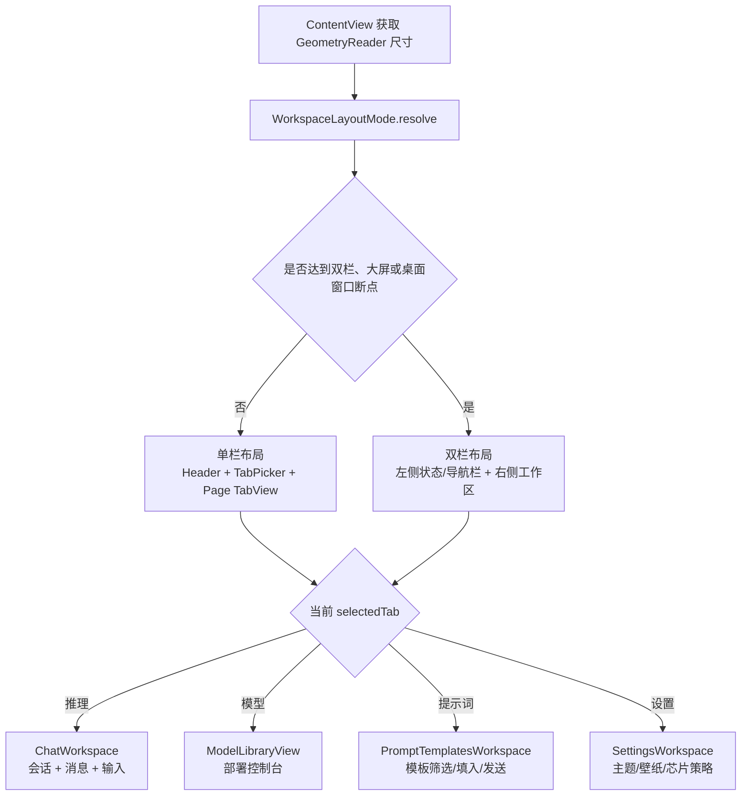
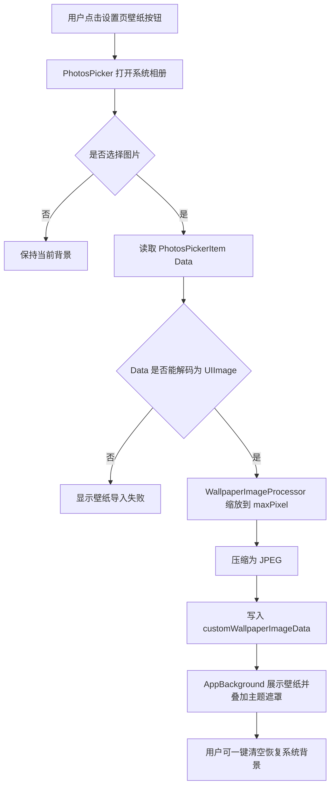
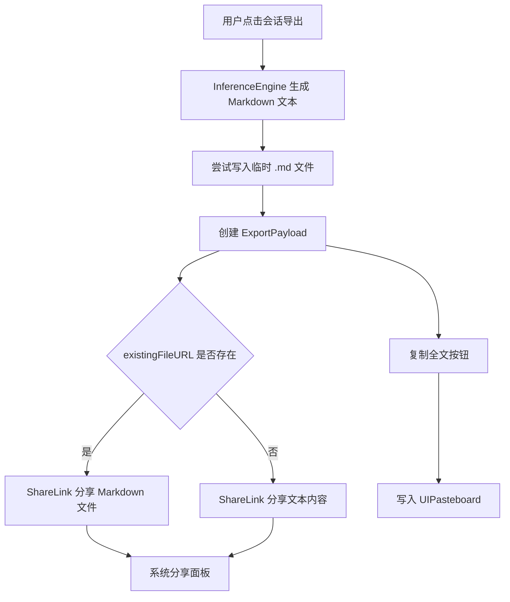
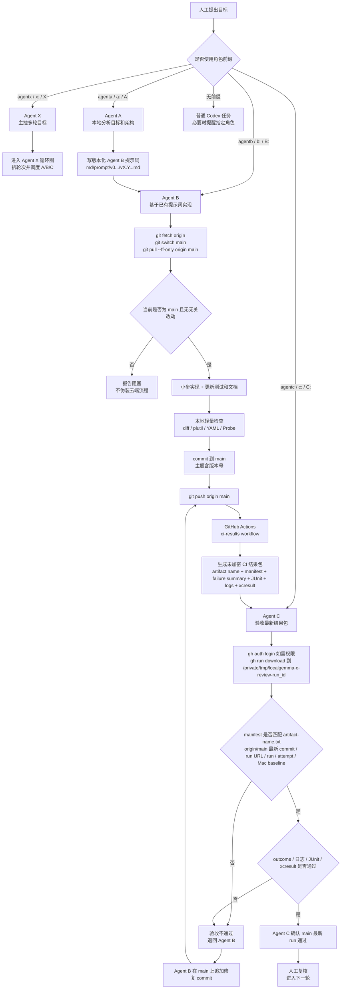
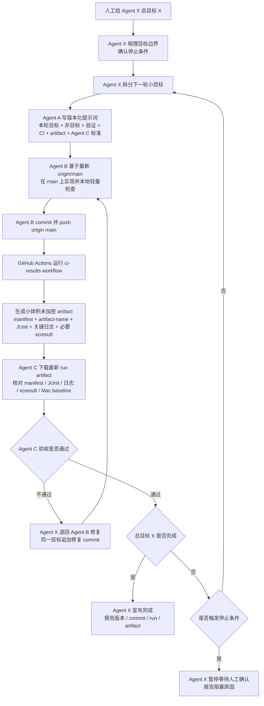

# 项目核心流程图

本文是 `md/flow/flow.md` 的 Mermaid 可视化版本。每张图前先给人工读图说明，图中节点使用中文注释，方便快速理解当前真实逻辑。

## 1. App 启动与全局状态

读图说明：这张图展示 App 启动时如何创建状态对象、扫描本地模型文件，并把状态注入 SwiftUI 界面。重点看 `ModelCatalog` 如何成为模型和 artifact 状态的入口。

## 2. 模型 artifact 校验流

读图说明：这张图展示本项目最重要的安全边界。模型文件存在不等于可真实运行，只有 concrete SHA-256 匹配后才进入 verified。

## 3. 推理与会话流

读图说明：这张图展示用户输入如何变成一轮模拟流式回答。当前默认 runtime 是模拟器，不会调用真实权重。

## 4. UI 布局与工作区流

读图说明：这张图展示 ContentView 如何根据容器尺寸选择单栏、compact 双栏或 regular 大屏双栏布局，然后进入具体工作区。iPhone 横屏、iPad 竖屏大画布、Mac Catalyst 和桌面窗口都走同一套尺寸断点。

## 5. 相册壁纸流

读图说明：这张图展示从相册选择图片后，项目如何压缩图片再保存为 App 背景，避免大图直接写入 AppStorage。

## 6. 会话导出与分享流

读图说明：这张图展示导出时为什么有文件分享和文本分享两条路径。目标是避免分享一个不存在的临时文件。

## 7. main 直推与云端结果包验收流

读图说明：这张图展示新的协作闭环。重点是 Agent B 必须在 `main` 上提交并推送，GitHub Actions 生成带自描述 manifest 的未加密结果包，Agent C 只能验收 `origin/main` 最新 commit 对应的 artifact name、run URL、run id 和 run attempt；失败时通过追加修复 commit 回到同一条主线。

## 8. Agent X 主控循环迭代流

读图说明：这张图展示未来人工用 `agentx`、`x:` 或 `X:` 给出总目标后，Agent X 如何拆分轮次并调度 Agent A、Agent B、GitHub Actions 和 Agent C。重点是 Agent X 只能根据 Agent C 对最新 artifact 的验收结论继续、退回、暂停或完成，不能跳过云端结果包复判。

