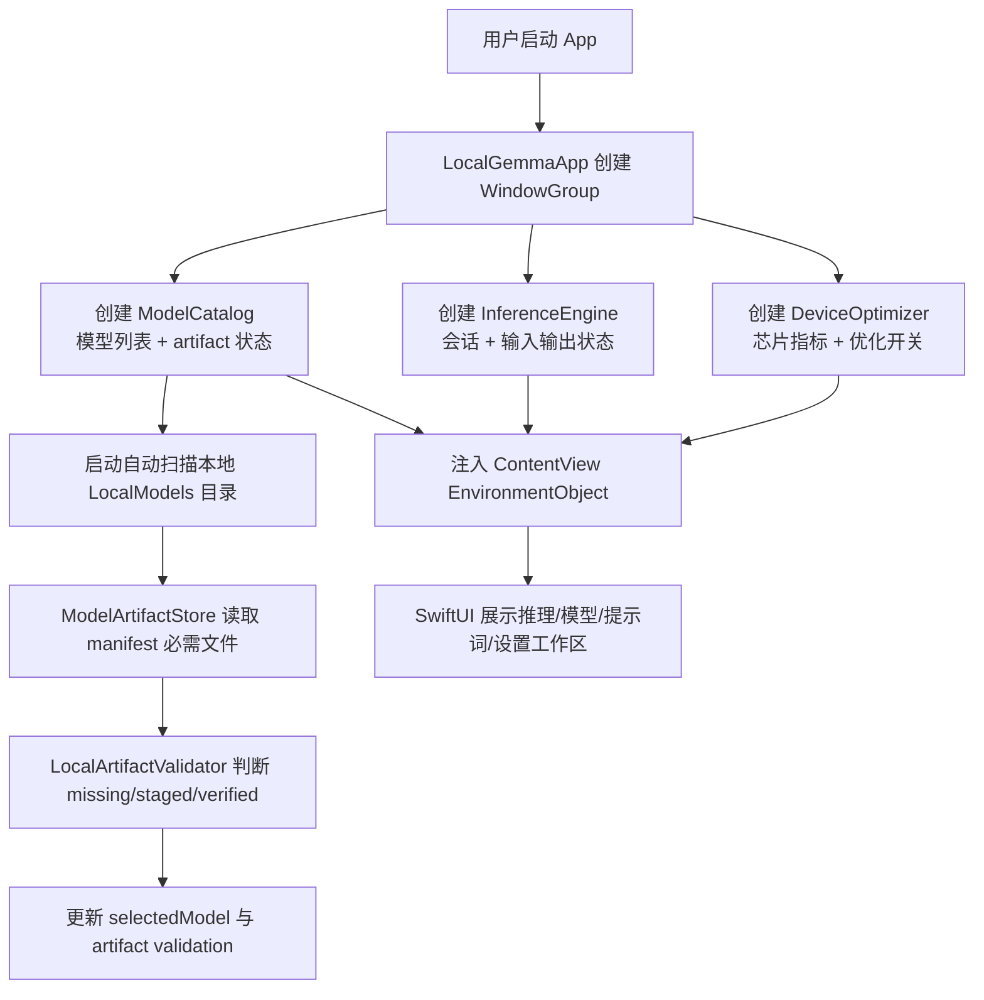
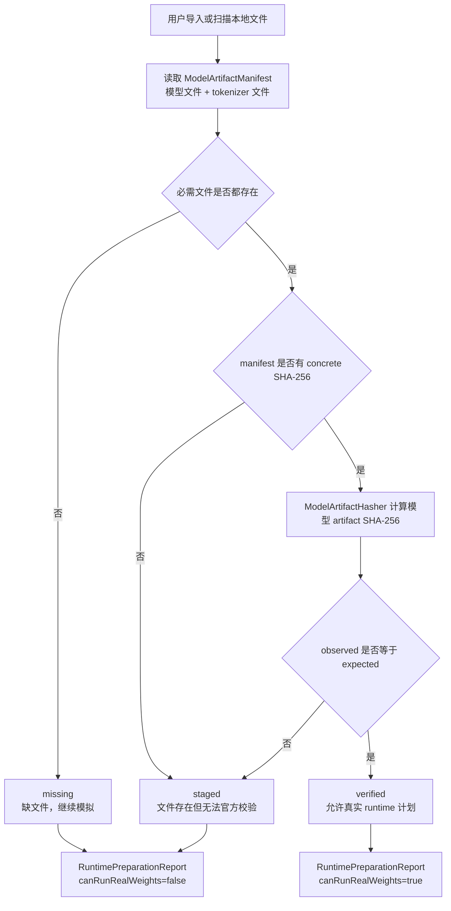
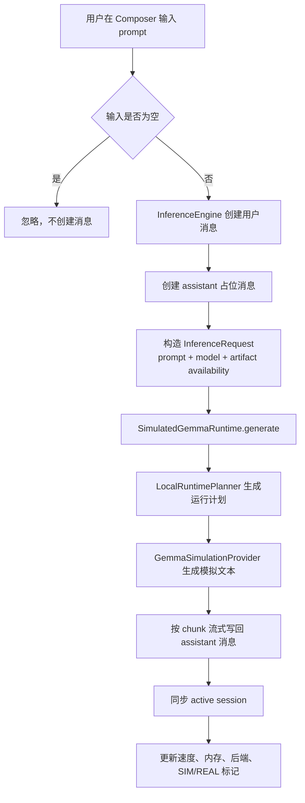
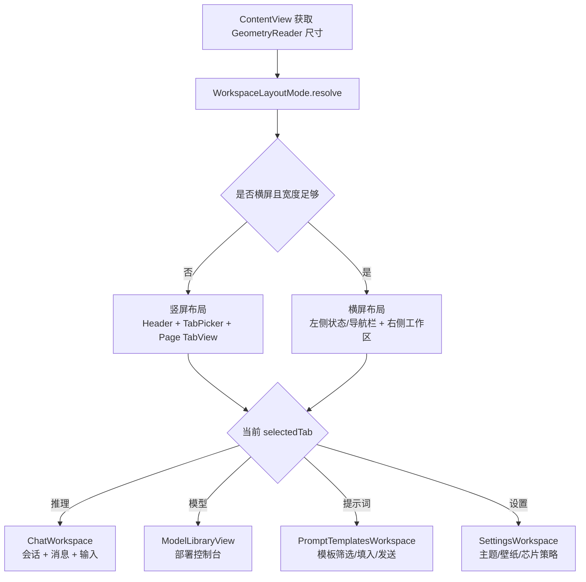
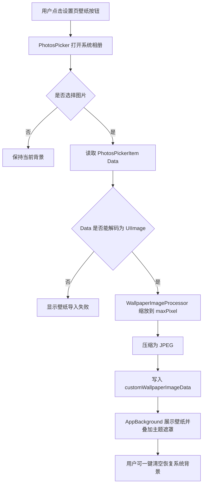
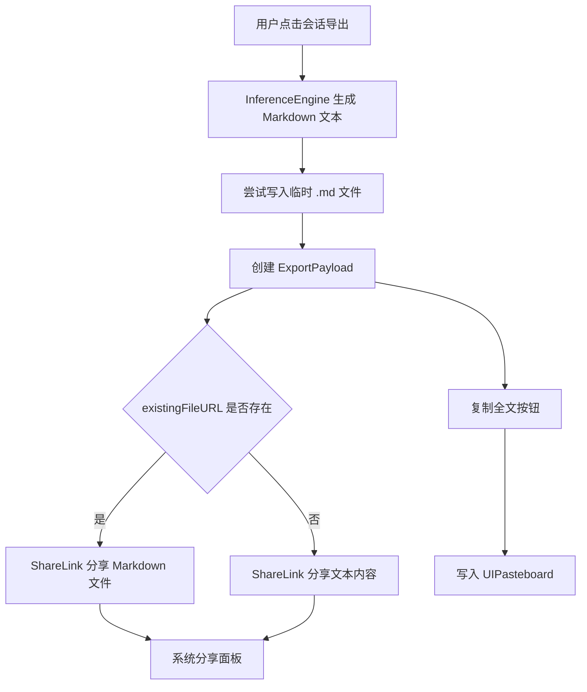

# 项目核心流程图

本文是 `md/flow/flow.md` 的 Mermaid 可视化版本。每张图前先给人工读图说明，图中节点使用中文注释，方便快速理解当前真实逻辑。

## 1. App 启动与全局状态

读图说明：这张图展示 App 启动时如何创建状态对象、扫描本地模型文件，并把状态注入 SwiftUI 界面。重点看 `ModelCatalog` 如何成为模型和 artifact 状态的入口。

## 2. 模型 artifact 校验流

读图说明：这张图展示本项目最重要的安全边界。模型文件存在不等于可真实运行，只有 concrete SHA-256 匹配后才进入 verified。

## 3. 推理与会话流

读图说明：这张图展示用户输入如何变成一轮模拟流式回答。当前默认 runtime 是模拟器，不会调用真实权重。

## 4. UI 布局与工作区流

读图说明：这张图展示 ContentView 如何根据屏幕尺寸选择竖屏或横屏布局，然后进入具体工作区。

## 5. 相册壁纸流

读图说明：这张图展示从相册选择图片后，项目如何压缩图片再保存为 App 背景，避免大图直接写入 AppStorage。

## 6. 会话导出与分享流

读图说明：这张图展示导出时为什么有文件分享和文本分享两条路径。目标是避免分享一个不存在的临时文件。

